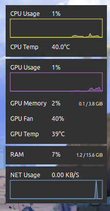

# System monitor desklet

System Monitor Cinnamon Desklet



## Usage

Dependencies

```
sudo apt install nvidia-smi net-usage
```

## "bin" files

Put net-usage and toggle-active-desklets files in $HOME/bin

Make shure .bashrc or .profile has the line:
```
export PATH=$PATH":$HOME/bin"
```
Allow file to execute in terminal
```
chmod +x $HOME/bin/net-usage
chmod +x $HOME/bin/toggle-active-desklets
```
## Active file

Create a file to active the desklets
```
touch $HOME/Documents/active_desklets
echo 1 > $HOME/Documents/active_desklets
```
Edit desklet.js at line 109 with you home folder path

Add shortcut ctrl+alt+d to run toggle-active-desklets command
